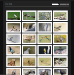
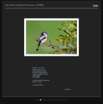

# Swiper Theme for Zenphoto

[![Contributors][contributors-shield]][contributors-url]
[![Forks][forks-shield]][forks-url]
[![Stargazers][stars-shield]][stars-url]
[![Issues][issues-shield]][issues-url]
[![License][license-shield]][license-url]
[![LinkedIn][linkedin-shield]][linkedin-url]

## About

This is a theme for [Zenphoto](https://www.zenphoto.org/), which uses the Javascript libraries
[Justified Gallery](https://miromannino.github.io/Justified-Gallery/) and [Swiper](https://swiperjs.com/) for the
browser presentation layer.

Both the gallery and the image pages use lazy loading to optimise load time. The image page can be swiped left and
right.  

Authenticated users can click the resized image to download the full sized image in a new tab.

See https://adamcc.ch/zenphoto/birds/ for an example of the theme running.

### Built With

[![PHP][PHP-shield]][PHP-url]
[![Zenphoto][Zenphoto-shield]][Zenphoto-url]
[![Javascript][Javascript-shield]][Javascript-url]
[![Justified Gallery][Justified-Gallery-shield]][Justified-Gallery-url]
[![Swiper][Swiper-shield]][Swiper-url]

## Usage

Copy the [swiper](swiper) folder from this project to your Zenphoto themes folder. Log in to Zenphoto as admin, and on
the Themes page, Activate and select Swiper as the current theme for galleries.

<!-- MARKDOWN LINKS & IMAGES -->
<!-- https://www.markdownguide.org/basic-syntax/#reference-style-links -->

## License

Distributed under the [Unlicense](https://unlicense.org/). See [LICENSE.md](LICENSE.md) for more information.

[contributors-shield]: https://img.shields.io/github/contributors/adam-crowther/zenphoto-swiper-theme.svg?style=for-the-badge

[contributors-url]: https://github.com/adam-crowther/zenphoto-swiper-theme/graphs/contributors

[forks-shield]: https://img.shields.io/github/forks/adam-crowther/zenphoto-swiper-theme.svg?style=for-the-badge

[forks-url]: https://github.com/adam-crowther/zenphoto-swiper-theme/network/members

[stars-shield]: https://img.shields.io/github/stars/adam-crowther/zenphoto-swiper-theme.svg?style=for-the-badge

[stars-url]: https://github.com/adam-crowther/zenphoto-swiper-theme/stargazers

[issues-shield]: https://img.shields.io/github/issues/adam-crowther/zenphoto-swiper-theme.svg?style=for-the-badge

[issues-url]: https://github.com/adam-crowther/zenphoto-swiper-theme/issues

[license-shield]: https://img.shields.io/github/license/adam-crowther/zenphoto-swiper-theme.svg?style=for-the-badge

[license-url]: https://github.com/adam-crowther/zenphoto-swiper-theme/blob/master/LICENSE.md

[linkedin-shield]: https://img.shields.io/badge/-LinkedIn-black.svg?style=for-the-badge&logo=linkedin&colorB=555

[linkedin-url]: https://www.linkedin.com/in/adam-crowther-5a51564/

[PHP-shield]: https://img.shields.io/badge/-PHP%205.6-4F5B93.svg?style=for-the-badge&logo=php

[PHP-url]: https://www.php.net/

[Zenphoto-shield]: https://img.shields.io/badge/-zenphoto-6c802e.svg?style=for-the-badge

[Zenphoto-url]: https://www.zenphoto.org/

[Javascript-shield]: https://img.shields.io/badge/-javascript%20ES6-1b1b1b.svg?style=for-the-badge

[Javascript-url]: https://developer.mozilla.org/en-US/docs/Web/JavaScript

[Justified-Gallery-shield]: https://img.shields.io/badge/-justified%20gallery-333.svg?style=for-the-badge

[Justified-Gallery-url]: https://miromannino.github.io/Justified-Gallery/

[Swiper-shield]: https://img.shields.io/badge/-swiper-111827.svg?style=for-the-badge

[Swiper-url]: https://swiperjs.com/